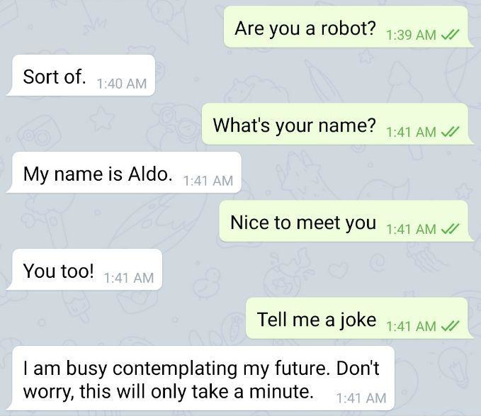

# [Aldo](https://github.com/pyzhyk/Aldo/)

[][license]

[license]: https://www.gnu.org/licenses/gpl.html

#### State-of-the-art artificial intelligence bot

### Demo: [telegram/AldoAIBot](https://t.me/AldoAIBot)

## Prerequisites
- MongoDB – [docs.mongodb.com/manual/installation](https://docs.mongodb.com/manual/installation/)
- IBM Watson account – [ibm.com/watson](https://www.ibm.com/watson)
- Telegram Bot – [core.telegram.org/bots](https://core.telegram.org/bots#6-botfather)

## Getting started

- `apt install python3.6 ffmpeg`
- `pip3 install --upgrade wikipedia chatterbot chatterbot-corpus "watson-developer-cloud>=2.4.1" langdetect nltk SpeechRecognition python-telegram-bot`
- Put your IBM Watson API and Telegram Bot Token at lines `60` and `100` respectively

## Training your bot:
- `python3.6 train.py`
- `python3.6 train-list.py`

(Training datasets may be changed in scripts)

## Running your bot: `python3.6 bot.py`

## Donate
**BTC 15EmrTsRjFuuiRgohSPKqDjjAXdisWULbs**
